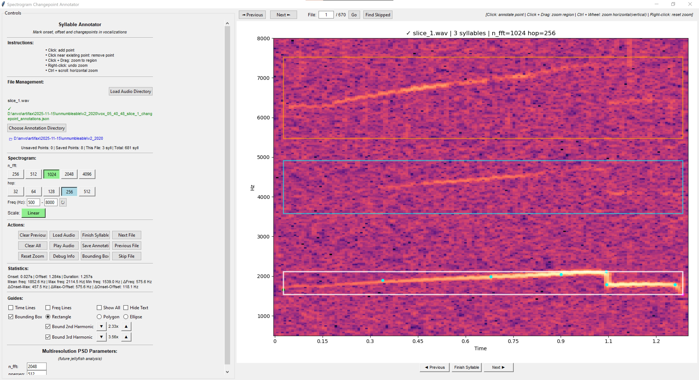

# YAAAT: Yet Another Audio Annotation Tool

Interactive bioacoustic annotation tool for measuring vocalizations. 

Features: 
1. Changepoint Annotator, for marking temporal onset, offset, and changepoints in vocalizations. Useful for describing rapid fluctuations and identifying nonlinear phenomena. 
2. Peak Annotator, for marking dominant frequency peaks on the power spectrum. Useful for describing spectrally complex vocalizations. 

<table>
  <tr>
    <td></td>
    <td></td>
  </tr>
  <tr>
    <td align="center">Changepoint Annotator</td>
    <td align="center">Peak Annotator</td>
  </tr>
</table>

## Installation

### Via PyPI (Recommended)
```bash
pip install yaaat
```

### From Source
```bash
git clone https://github.com/laelume/yaaat.git
cd yaaat
pip install -e .
```

## Usage

### Launch the Application
```bash
yaaat
```
Opens a tabbed interface with both annotators. Includes test audio files to get started immediately.

### Use in Python Scripts
```python
from yaaat import ChangepointAnnotator, PeakAnnotator
import tkinter as tk

# Launch changepoint annotator
root = tk.Tk()
app = ChangepointAnnotator(root)
root.mainloop()

# Or launch peak annotator
root = tk.Tk()
app = PeakAnnotator(root)
root.mainloop()
```

## Getting Started

1. Click **Load Audio Directory** to select files or **Load Test Audio** to explore test audio
2. Choose where to save annotations (existing, new, or default directory)
3. Click on the spectrogram to add annotation points
4. Click **Finish Syllable** when done with annotation
5. Move between files using **Next/Previous** buttons
6. Annotations auto-save on file navigation or **Finish syllable**

## Navigation & Features

- Intuitive real-time interactive visualization with zoom, pan, and keycommand + mousewheel navigation
- Visualize harmonics with adjustable multipliers and draggable bounding boxes
- JSON annotations saved per-file to minimize corruption
- Mark and track unusable files
- Adjust spectrogram resolution for accuracy comparison

- TODO: implement ranking system for annotation quality; inject as learning feedback mechanism

## Requirements

- Python ≥3.8 (built using 3.11)
- numpy
- matplotlib
- librosa
- scipy
- natsort
- sounddevice
- soundfile

## License

MIT License - Copyright (c) 2025 laelume

## Contributing

Contributions welcome! Please open an issue or submit a pull request. I'm especially interested in talking to people about using this in their existing AI workflows, so please feel free to reach out !!
